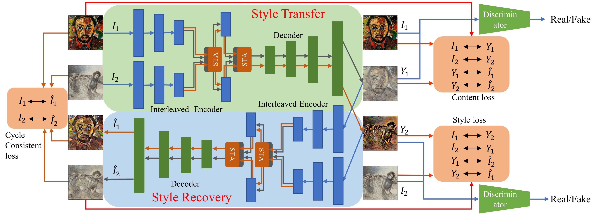

#Content-Consistent Style Transfer with Style-Transition Attention Cycle Network

The supplementary materials contain the source code for the paper Content-Consistent Style Transfer with Style-Transition Attention Cycle Network。

# Requirements

1. *pyhton 3.6*
2. *torch=1.0.0*
3. *torchvision=0.2.1*
4. *numpy=1.15.4*
5. *GPU memory >=33G*

## Dataset
Download the [MSCOCO](http://cocodataset.org/#download)  dataset and [Wikiart](https://www.kaggle.com/c/painter-by-numbers) dataset .

use **dataset.py** to preprocess the dataset for training.

# Training
If you want to train the whole network from beginning using source code, please Use **train.py** to train our model, example usage:

    python train.py 
    	--batch_size 12 
    	--epoch 20 
    	--learning_rate ./5e-5
    	--train_content_dir ./content
    	--train_style_dir ./style

## Evaluation 
After the training, we get three trained models (**attn_14_epoch.pth** , **decoder_14_epoch.pth**, **vgg_encoder_14_epoch.pth**) and run the **test.py** using them.

    python test.py
    	--content ./content_test_dir
    	--style ./style_test_dir
    	--attn_state_path ./
    	--decoder_state_path ./
    	--vgg_state_path ./
## Video stylization
If you want to transfer the style of a video to another, please follow subsequent steps.

1. video -> frames
2. transfer the style of frames
3. frames -> video

### Example usage:

`
    python process_video.py
`

